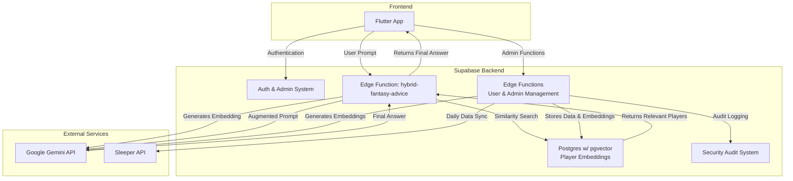

# rem_mm

**Roster Evaluation Model Mastermind (rem_mm)** is an AI-powered fantasy football assistant designed to provide expert-level analysis and recommendations for your Sleeper fantasy football leagues. It acts as your personal AI "Assistant GM," leveraging Google Gemini to help you make smarter roster decisions, identify sleeper players, and win your league.

## 🏗️ Core Architecture

The application is built on a modern, scalable architecture using a Flutter frontend and a Supabase backend. The core logic for AI interaction is handled through a **Retrieval-Augmented Generation (RAG)** pattern, ensuring that the AI has relevant, up-to-date context without being overwhelmed by large data files.



## 🛠️ Tech Stack

- **Frontend**: Flutter (iOS, Android, Web, Desktop)
- **Backend-as-a-Service**: Supabase
- **Database**: Supabase Postgres with pgvector extension
- **Backend Logic**: Supabase Edge Functions (Deno/TypeScript)
- **AI Model**: Google Gemini (gemini-2.0-flash-exp + text-embedding-004)
- **External Data**: Sleeper API
- **Authentication**: Hybrid Supabase auth + custom user management
- **Security**: Role-based access control with comprehensive audit logging

## 🧠 Detailed Data Flow (Hybrid RAG Pattern)

The key innovation is our **cost-optimized hybrid RAG architecture** that handles Sleeper's massive 5MB `players.json` file efficiently while reducing embedding API costs by **120x**.

### 1. **Smart Data Ingestion** (Automated Daily)

Our `simple-ingestion` Edge Function runs daily to keep player data fresh:

- **Fetch**: Calls Sleeper API's `/players/nfl` endpoint
- **Smart Chunking**: Each player becomes a semantic chunk: `"Player: Patrick Mahomes, Position: QB, Team: KC, Status: Active"`
- **Selective Embedding**: Only generates embeddings for new/changed players (cost optimization)
- **Storage**: Stores player data, chunks, and 768-dimensional vectors in `player_embeddings` table

### 2. **Intelligent Query Processing** (On-Demand)

When users ask questions via the Flutter app:

1. **Query Embedding**: User prompt → Gemini Embedding API → vector representation
2. **Similarity Search**: pgvector finds most relevant player chunks using cosine similarity
3. **Context Augmentation**: Constructs focused prompt with relevant player context
4. **AI Generation**: Gemini Pro generates context-aware, accurate responses
5. **Response Delivery**: Structured answer returned to Flutter app

**Example Augmented Prompt:**
```
Context:
- Player: Jordan Love, Position: QB, Team: GB, Status: Active
- Player: C.J. Stroud, Position: QB, Team: HOU, Status: Active  
- Player: Anthony Richardson, Position: QB, Team: IND, Status: Questionable

Question: Who are some good waiver wire QBs with high upside?

Based on the context provided, answer the user's question with specific recommendations.
```

## 🔐 Security & Admin System

### Role-Based Access Control
- **Three-tier system**: `user` → `admin` → `super_admin`
- **Comprehensive audit logging**: All actions tracked in `security_audit` table
- **Admin management API**: Complete role management via `admin-management` Edge Function

### Authentication Architecture
- **Hybrid system**: Supabase `auth.users` + custom `app_users` table
- **Sleeper integration**: Links Supabase users to Sleeper accounts via `sleeper_user_id`
- **JWT + Manual auth**: Supports both token-based and manual authentication for testing

### Admin Features
- **User Management**: List users, change roles, view activity
- **Audit Trail**: Complete history of role changes and system access
- **Security Monitoring**: Real-time logging of all admin actions

## 🚀 Edge Functions API

### Core RAG System
- `hybrid-fantasy-advice`: Main AI query handler with optimized embedding search
- `simple-ingestion`: Daily NFL data ingestion with cost-optimized embedding generation

### User Management
- `user-sync`: Sleeper user registration and league/roster synchronization  
- `user-session`: Session management and authentication utilities
- `auth-user`: Authentication helper functions
- `get-auth-token`: JWT token generation for testing

### Admin Management
- `admin-management`: Complete role-based access control system
  - Check admin status: `{"action": "check_admin_status"}`
  - List users: `{"action": "list_users"}` (admin only)
  - Change roles: `{"action": "change_role"}` (admin only)
  - Audit logs: `{"action": "get_role_audit"}` (admin only)

## 📊 Database Schema

### Core Tables
- `player_embeddings`: NFL player data with 768-dimensional vectors
- `app_users`: User profiles with Sleeper integration and role management
- `security_audit`: Comprehensive activity logging
- `admin_role_changes`: Audit trail for role modifications

### Key Functions
- `is_admin()` / `is_super_admin()`: Role checking with context awareness
- `change_user_role()`: Secure role modification with audit logging
- `get_user_role()`: Direct role lookup bypassing RLS for admin functions

## 🏁 Getting Started

### Prerequisites
- Flutter SDK
- Supabase CLI
- Google Gemini API key

### Environment Setup
```bash
# Clone repository
git clone https://github.com/alloatech/rem_mm.git
cd rem_mm

# Install Flutter dependencies
flutter pub get

# Generate required files
dart run build_runner build

# Start local Supabase
cd supabase
supabase start

# Serve Edge Functions
supabase functions serve
```

### Environment Variables
Create `.env` file with:
```
SUPABASE_URL=your_supabase_url
SUPABASE_ANON_KEY=your_anon_key
GOOGLE_GEMINI_API_KEY=your_gemini_key
```

## 🧪 Testing Admin Features

Test the admin system using the `th0rjc` super admin account:

```bash
# Check admin status
curl -X POST 'http://127.0.0.1:54321/functions/v1/admin-management' \
  -H 'Content-Type: application/json' \
  -d '{"action": "check_admin_status", "sleeper_user_id": "872612101674491904"}'

# List all users (admin only)
curl -X POST 'http://127.0.0.1:54321/functions/v1/admin-management' \
  -H 'Content-Type: application/json' \
  -d '{"action": "list_users", "sleeper_user_id": "872612101674491904"}'
```

## 🎯 Development Roadmap

### ✅ Completed
- [x] Hybrid RAG architecture with cost optimization
- [x] Sleeper API integration and user management
- [x] Comprehensive admin role system
- [x] Security audit logging
- [x] Edge Functions API architecture

### 🚧 In Progress
- [ ] Flutter admin UI integration
- [ ] Role-based access control in mobile app

### 📋 Planned
- [ ] Real-time notifications
- [ ] Advanced analytics dashboard
- [ ] Multi-league support enhancements
- [ ] Mobile app optimization

## 🤝 Contributing

1. Fork the repository
2. Create your feature branch (`git checkout -b feature/amazing-feature`)
3. Commit your changes (`git commit -m 'Add amazing feature'`)
4. Push to the branch (`git push origin feature/amazing-feature`)
5. Open a Pull Request

## 📄 License

This project is licensed under the MIT License - see the [LICENSE](LICENSE) file for details.

## 🙏 Acknowledgments

- **Supabase** for the excellent BaaS platform
- **Google Gemini** for powerful AI capabilities
- **Sleeper** for comprehensive fantasy football data
- **Flutter** for cross-platform development excellence